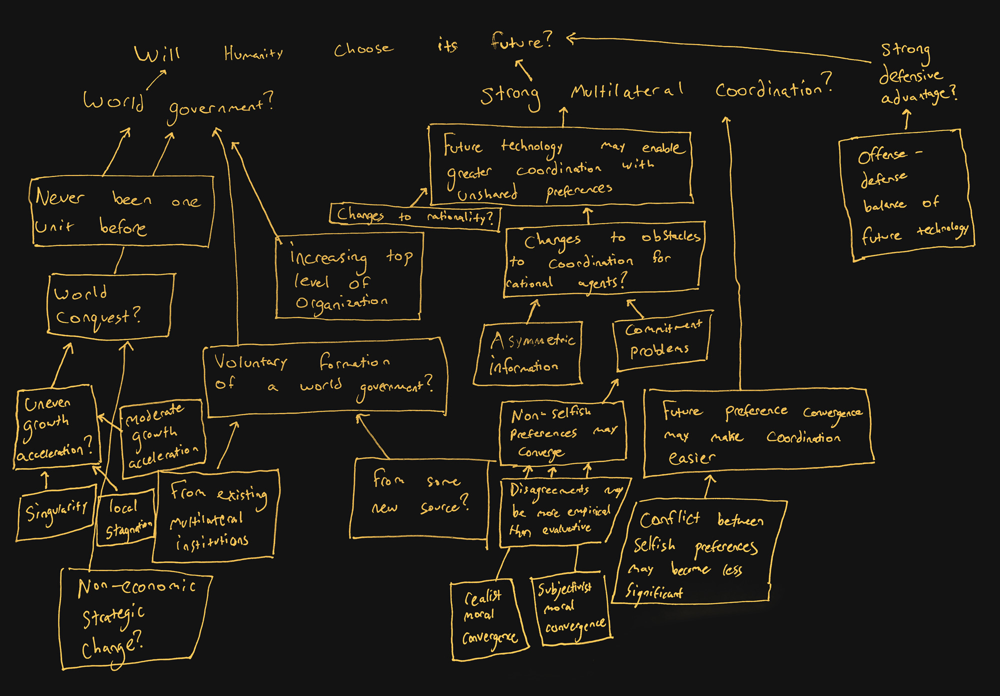

[Guive Assadi](https://www.governance.ai/team/guive-assadi) is a Research Scholar at the [Center for the Governance of AI](https://www.governance.ai). Guive’s research focuses on the conceptual clarification of, and  prioritisation among, potential risks posed by emerging technologies. He holds a master’s in history from Cambridge University, and a bachelor’s from UC Berkeley.

In this episode, we discuss Guive's paper, ['Will Humanity Choose Its Future?'](https://philarchive.org/rec/ASSWHC).
* What is an 'evolutionary future', and would it count as an existential catastrophe?
* How did the agricultural revolution deliver a world which few people would have chosen?
* What does it mean to say that we are living in the ['dreamtime'](https://www.overcomingbias.com/p/this-is-the-dream-timehtml)? Will it last?
* What competitive pressures in the future could drive the world to undesired outcomes?
  * Digital minds
  * Space settlement
* What measures could prevent an evolutionary future, and allow humanity to more deliberately choose its future?
  * World government
  * Strong global coordination
  * Defensive advantage
* Should this all make us more or less hopeful about humanity's future?
* Ideas for further research

## Guive's recommended reading

* ['Rationalist Explanations for War'](https://web.stanford.edu/group/fearon-research/cgi-bin/wordpress/wp-content/uploads/2013/10/Rationalist-Explanations-for-War.pdf) by James D. Fearon
* [Meditations on Moloch](https://slatestarcodex.com/2014/07/30/meditations-on-moloch/) by Scott Alexander
* *[The Age of Em](https://ageofem.com/)* by Robin Hanson
* [What is a Singleton?](https://nickbostrom.com/fut/singleton) By Nick Bostrom

## Further reading

- ['Will Humanity Choose Its Future?'](https://philarchive.org/rec/ASSWHC) by Guive Assadi
- [Colder Wars](https://gwern.net/colder-war) by Gwern
- [Research Note: Intergenerational Transmission Is Not Sufficient for Positive Long-Term Population Growth](https://read.dukeupress.edu/demography/article/59/6/2003/319359/Research-Note-Intergenerational-Transmission-Is) by Kurt et al.
- *[The Secret of Our Success: How Culture Is Driving Human Evolution, Domesticating Our Species, and Making Us Smarter](https://www.goodreads.com/en/book/show/25761655)* by Joseph Henrich
  - [Review](https://slatestarcodex.com/2019/06/04/book-review-the-secret-of-our-success/) by Scott Alexander

## Transcript

*Coming soon!*

