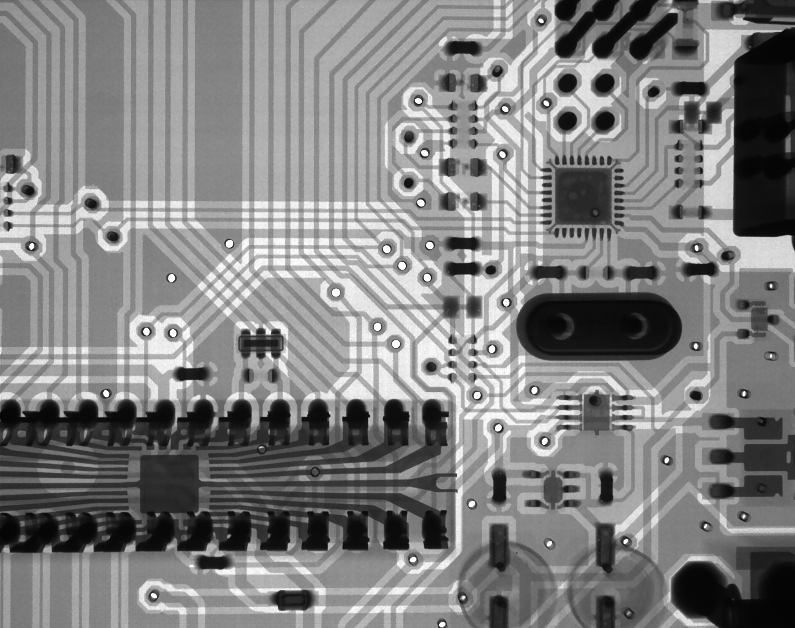

[Jon Y](https://www.asianometry.com/) is the creator of the [Asianometry YouTube channel](https://www.youtube.com/c/Asianometry) and accompanying newsletter. He describes his channel as making "video essays on business, economics, and history. Sometimes about Asia, but not always."

In this episode we talk about:

* Compute trends driving recent progress in Artificial Intelligence;
* The semiconductor supply chain and its geopolitics;
* The buzz around LK-99 and superconductivity.

## Jon's recommended reading

* [The History of Semiconductor Engineering](https://link.springer.com/book/10.1007/978-3-540-34258-8) by Bo Lojek
* [Tiger Technology: The Creation of a Semiconductor Industry in East Asia](https://www.goodreads.com/book/show/2868042-tiger-technology) by John Matthews and Dong-Sung Cho
* [Handbook of East Asian Entrepreneurship](https://www.routledgehandbooks.com/doi/10.4324/9781315765693) by Fu-Lai Tony Yu and Ho-Don Yan

## More resources

* Asianometry has its own playlists, including [Semiconductor "Course"](https://www.youtube.com/watch?v=Pt9NEnWmyMo&list=PLKtxx9TnH76QY5FjmO3NaUkVJvTPN9Vmg) and [Computer History](https://www.youtube.com/watch?v=MgDZQy0nN-Y&list=PLKtxx9TnH76QV56t5_ty1TDWQ2xmv75bs), which are great places to find relevant videos
  * In this interview we especially drew on [The Coming AI Chip Boom](https://www.youtube.com/watch?v=L0948yq2Hqk), [How Nvidia Won AI](https://www.youtube.com/watch?v=GuV-HyslPxk), and [AI's Hardware Problem](https://www.youtube.com/watch?v=5tmGKTNW8DQ&pp=ygUkYXNpYW5vbWV0cnkgYXJ0aWZpY2lhbCBpbnRlbGxpZ2VuY2Ug)
  * We also mentioned [LK-99 Wouldn't Have Changed Semiconductors Anyway](https://www.youtube.com/watch?v=dBhBqOirJ4A), [How China Got the Bomb](https://www.youtube.com/watch?v=ZpBxBuIzbV8), and [India's Semiconductor Failure](https://www.youtube.com/watch?v=isBYV6QWDIo)
* Semiconductor blogs
  * [Fabricated Knowledge](https://www.fabricatedknowledge.com/) [blog]
  * [Semi Analysis](https://www.semianalysis.com/) [blog]
  * [The Chip Letter](https://thechipletter.substack.com/) [blog]
  * [China Talk](https://www.chinatalk.media/) [blog/podcast]
  * [SemiWiki](https://semiwiki.com/) [open forum]
  * [SemiEngineering](https://semiengineering.com/) [news site]
* Other related podcast episodes
  * [Chris Miller on the History of Semiconductors, TSMC, and the CHIPS Act](https://hearthisidea.com/episodes/miller)
  * [Jaime Sevilla on Trends in Machine Learning](https://hearthisidea.com/episodes/sevilla)
  * [Lennart Heim on the compute governance era and what has to come after](https://80000hours.org/podcast/episodes/lennart-heim-compute-governance/)

