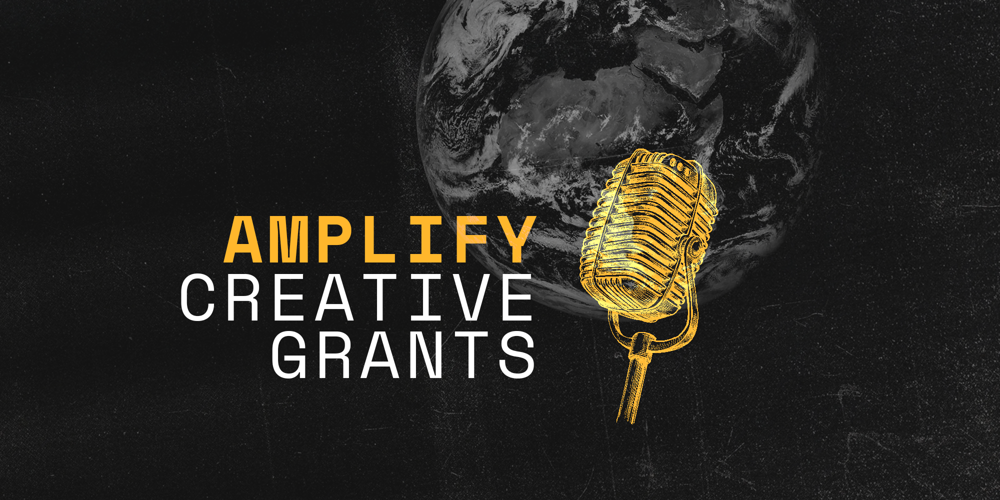

import { Link } from "gatsby"
import Seo from "../components/seo"
import Layout from "../components/layout"
import "../styles/recommendations.scss"

<Layout>
<Seo title="Grants" myStaticFeaturedImage="/grants.png"/>

<h1>Amplify creative grants</h1>

**A creative media small grants program supported by [Hear This Idea](https://hearthisidea.com/).**

**October 22nd update:** we were really impressed with the number and quality of applications over the last few weeks. However, we will **no longer be actively considering new applications**. Thanks for your understanding.

Over the next few months, we’re aiming to make grants to podcasts and other creative media projects that spread ideas to help humanity navigate this century. 

We’re interested in applications that look to cover topics related to (i) reducing existential risk, (ii) helping fix pressing global problems, and (iii) putting humanity on a positive long-term trajectory. More details on all three below.

We want to amplify ideas associated with [effective altruism](https://www.effectivealtruism.org/) and [longtermism](https://longtermism.com/), but you don’t need to be actively engaged with effective altruism to apply.

We’re excited to support projects (new and existing) in English **and other languages** — sharing important ideas with new, global, audiences. 

If you are unsure whether your idea fits among the areas we outline below, please lean toward applying— we want to hear your ideas! The [form](https://grants.hearthisidea.com/apply) is a single page of questions, and should easily take less than an hour. The first batch of grants will be approved around three weeks after this announcement. After that, we’ll approve grants on a rolling basis. Let us know if you have a deadline you need to hear back by, and we’ll do our best to accommodate and get back very quickly if necessary. If you have any questions which aren’t answered below, please contact us on [grants@hearthisidea.com](mailto:grants@hearthisidea.com). You can apply now by [following this link](https://grants.hearthisidea.com/apply).

    <a
        className="listen"
        href="https://grants.hearthisidea.com/apply"
        target="_blank"
        rel="noopener noreferrer"
    >
        Apply now &#8594;
    </a>

## We want to support podcasts and other media with a plan for impact

We are interested in supporting podcasts and other creative media projects, new and existing, which care about:

- **Reducing** [**(existential) risks**](https://www.fhi.ox.ac.uk/Existential-risk-and-existential-hope.pdf) **this century:** We’d love to see podcasts sharing knowledge relevant for reducing risks from [AI](https://80000hours.org/problem-profiles/artificial-intelligence/), [biosecurity](https://80000hours.org/problem-profiles/preventing-catastrophic-pandemics/), and other [global catastrophes](https://80000hours.org/problem-profiles/). We can also imagine projects that focus on methods and infrastructure for mitigating global risks, like forecasting or evidence-informed policymaking.
- **Helping fix** [**global problems**](https://80000hours.org/problem-profiles/)**:** We want to see more media exploring how to make progress on the world’s most pressing problems, and reduce suffering in the world today. Topics might include: [reducing factory farming](https://80000hours.org/problem-profiles/factory-farming/), [neglected issues in global health and wellbeing](https://80000hours.org/problem-profiles/health-in-poor-countries/), or [wild animal suffering](https://80000hours.org/problem-profiles/wild-animal-welfare/). 
- **Putting humanity on a positive** [**long-term**](https://www.bbc.com/future/article/20220805-what-is-longtermism-and-why-does-it-matter) **trajectory:** We are excited by projects that look to help inform the following questions: How could we positively influence humanity’s future if we make it through this century? How can we think about sharing a world with AI systems smarter than humans? What [values should guide](https://80000hours.org/problem-profiles/promoting-positive-values/) our future? What [political institutions](https://globalprioritiesinstitute.org/wp-content/uploads/Tyler-M-John-and-William-MacAskill_Longtermist-institutional-reform.pdf) could help us collectively think over long time horizons?

We want to support projects about —or relevant to— important problems. But we’re especially excited about applicants who have thought carefully about how their project could actually help make progress on these problems.

Here are some ways that an impactful podcast or creative media project might do that: 

- **Field building:** Several emerging research fields are oriented around the principles of effective altruism (like global priorities research, AI alignment and strategy, or welfare biology). A communication project focused on one of these (sub-)fields could help distill existing work, and inspire more of it.
- **Advocacy:** Advocacy makes most sense when you [have an audience in mind](https://kk.org/thetechnium/1000-true-fans/). A project that has access to a small but select audience (for example policymakers, entrepreneurs, or academics in an impactful field) can have impact through changing minds on important topics. 
- **Information:** Even once someone is convinced of the importance of a pressing problem, they still need to be well informed about it in order to make well-motivated decisions. But it’s often difficult to find and digest the most relevant research. You could help by *distilling* existing research to make this process more efficient, or even by doing your own research and communicating the result: giving out new information.
- **Community building:** Perhaps the greatest effect of podcasts like [80,000 Hours](https://80000hours.org/podcast/) has been to grow the community around [effective altruism](https://www.effectivealtruism.org/). We’d love to see podcasts that had the same effect, especially for particular causes, sub-communities and non-english language groups.

We are especially excited about projects which have specific audiences in mind, particularly those that are currently more neglected; like podcasts for non-English language speaking communities.There’s no limit to how niche or technical your project could be — you don’t need to appeal to everyone as long as you can offer something really useful for some people!

We are **unlikely** to fund projects which aim to be very general introductions to effective altruism, which claim to speak *on behalf* of effective altruism, or do general community building, unless they have an additional reason for existing (they are for an under-served audience, or they bring a valuable new perspective).

## Grants can cover time, equipment, or help

**With grants from $500 to $10,000, we can help you:**

- **Buy equipment** to start or improve your show (we can also recommend equipment).
- **Cover your time** to produce your work
- **Outsource some work**: in some contexts a grant could pay for an audio editor, graphic designer, research assistant, or other relevant contractor.

We also encourage you to apply with more ambitious or scalable ideas in mind — such as a grant to cover many months of work; or even support a multi-person project. 

**Our grantees will have access to a supportive community of creators.** Grantees will also be invited to join a Slack community where they can share ideas and best practices, seek collaboration, and coordinate outsourcing work. Other possible benefits are online mixer events, seminars, and, perhaps, the formation of a more permanent podcast network. 

We will adjust any (optional) benefits to suit the needs of the grantees.

## Concrete examples of projects we’d be excited to see

Here are some illustrative (imaginary) podcast pitches we’d feel good about supporting: 

- You’re from a group or region that is underrepresented within the effective altruism community, and you want to communicate some ideas from EA in a way that is sensitive to that cultural context. You hope this will contribute to **community-building** amongst this group. 
- You have a background in EU law, and you plan on making a 5-part podcast series summarising “lessons and misconceptions about tech regulation in the EU”, to help **inform** an audience interested in working on tech regulation in the context of AI. 
- You are well positioned to bring together thinkers from an embryonic research area (S-risks, or wild animal welfare, for example), to have roundtable discussions on key issues in their field. You are aiming to **field-build**, promoting interest in and respect for the topics discussed. 
- You want to make a podcast series investigating the emergence of [previous pandemics](https://en.wikipedia.org/wiki/1977_Russian_flu). You aim to **advocate** for the importance of early pandemic prevention in a way that is accessible to voters in upcoming referendums.
- You’re planning on giving a lecture series (e.g. a primer on the psychology of effective giving), and you’re considering buying some audio (and maybe video) gear in order to share it online. 
- You want to record narrations of existing EA writing (or translations of it) which you think would work well as an audio podcast, or animated youtube video.

We’re also open to funding non-podcast creative projects which have impact in a similar way, for example:

- You have some experience with forecasting, and you want to make a practical video guide to forecasting on Metaculus; like an updated version of Alex Lawsen’s [Intro to Forecasting YouTube series](https://www.youtube.com/watch?v=e6Q7Ez3PkOw). You hope this will **inform** future forecasters to get up to speed faster. 
- You’re an audio editor, and you’d love to start taking more impactful editing work. A grant could help cover your time to find a role.
- You’re a web developer, and you plan on working on a web project that visualises some important facts about the world (such as from [this post](https://forum.effectivealtruism.org/posts/rXYW9GPsmwZYu3doX/what-happens-on-the-average-day))
- You’re a writer, and you need some funding to let you spend some time writing freelance for a publication. 

Some existing podcast projects for inspiration:

- **Valuable writing recorded well:** The [Astral Codex Ten Podcast](https://sscpodcast.libsyn.com/), the [LessWrong Curated Podcast](https://www.lesswrong.com/posts/kDjKF2yFhFEWe4hgC/announcing-the-lesswrong-curated-podcast), the [Metaculus Journal Podcast](https://www.metaculus.com/questions/11102/introducing-the-metaculus-journal-podcast/), the [Cold Takes Podcast](https://www.cold-takes.com/), the [Nonlinear Library](https://forum.effectivealtruism.org/posts/JTZTBienqWEAjGDRv/listen-to-more-ea-content-with-the-nonlinear-library), and [Radio Bostrom](https://radiobostrom.com/) all make difficult ideas easier to digest for people who don’t habitually read papers or blog posts. 
- **Interview podcasts on important ideas:** [AXRP](https://axrp.net/), [The Inside View](https://www.youtube.com/channel/UCb9F9_uV24PGj6x63PhXEVw), and the [Clearer Thinking Podcast](https://www.clearerthinking.org/podcast) help share and distil research in a faster and more engaging way than simply relying on people reading papers.
- **Academics sharing relevant research in engaging ways:** We can’t think of podcasts like this for effective altruist areas (why not make one?), but creative examples are [The History of Philosophy without Any Gaps](https://historyofphilosophy.net/) and [Reviewer 2 does geoengineering](https://podcasts.apple.com/us/podcast/reviewer-2-does-geoengineering/id1529459393). 
- **Non-specialists reporting on topics:** [Vox’s Future Perfect podcast](https://www.vox.com/future-perfect-podcast) is a great example of non-specialists sharing EA-related ideas in an engaging way.
- **Websites that convey important concepts in a creative way:** The [Possible Worlds Tree](https://possibleworldstree.com/), [Quizmanity](https://www.quizmanity.org/), [Look-Up Timeline](https://madeleinemc.github.io/look-up/).

    <a
        className="listen"
        href="https://grants.hearthisidea.com/apply"
        target="_blank"
        rel="noopener noreferrer"
    >
        Apply for an Amplify creative grant &#8594;
    </a>

 

</Layout>

